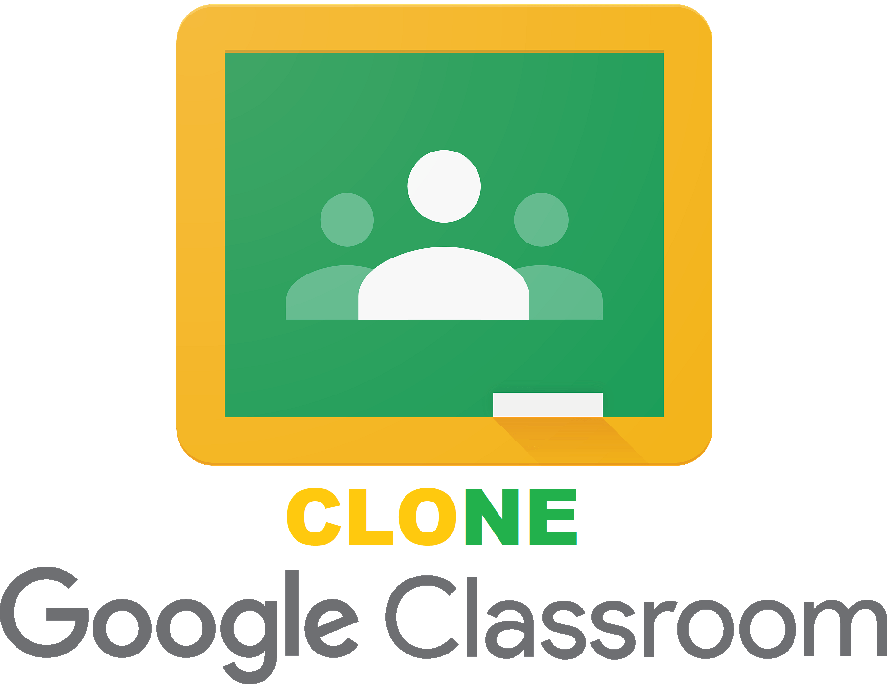

# WELCOME TO `Google-classroom-clone`

  

## Project Description
* This is my Google Classroom Clone which is just Google Classroom itself but with my features :laughing:
* The project will focus on everything required in [`description.pdf`](description.pdf)
* Framework I used: Boostrap 4

## Project backlog

- [x] Login - Logout - Signup - Forgot password
  - [x] Login
  - [x] Signup
  - [x] Logout
  - [x] Forgot password 
  - [ ] Email verification
- [x] User privileges 
  - [x] Admin
  - [x] Teacher
  - [x] Student
- [ ] Classroom interaction
  - [x] Create classs
  - [x] Delete class
  - [x] Edit class
  - [ ] Search class
- [ ] Classroom management
  - [ ] For teachers
    - [ ] View Student list
    - [ ] Add students
    - [ ] Remove students
    - [x] Post News, documents, images
    - [x] Remove News, documents, images
    - [ ] Comment on news
    - [ ] Delete comments
    - [ ] Create assignments
  - [ ] For students
    - [ ] Join class using class code
    - [ ] View class list
    - [ ] View news
    - [ ] Download images
    - [ ] Download documents
    - [ ] Comment on news
- [x] Responsive web design
- [] Email notification, Password hashing

## Change logs: 
  - There are some minor errors in `TrangNguoiDung.php` from `Trang_giao_vien` folder:
    - Fix `delete_posts.php` when it cannot return to the right class id
  - Added function shortening the `class_name` by string... when the length is bigger than 20
  - Delete classes got problems with foreign key from `posts` table in the database so we have to truncate everything in `posts` which has selected `class_id`
  - Change class card content - Replace Class code with teacher name
    
## Localhost used
* [XAMPP](https://www.apachefriends.org/download.html) 
* SQL port: 3308
* Apache port: 80,443

## Release day
2/12/2020 :bicyclist:

